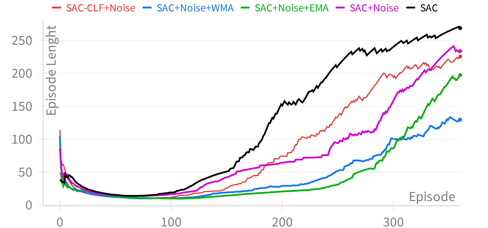
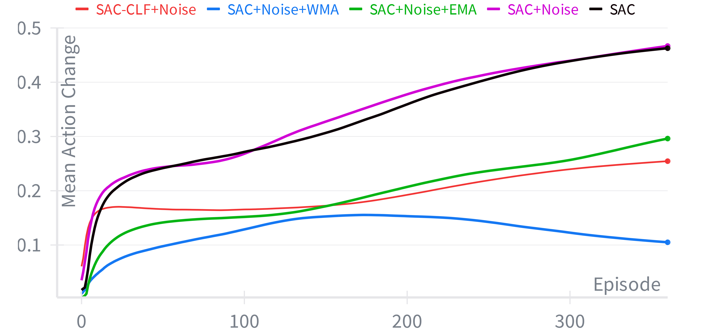
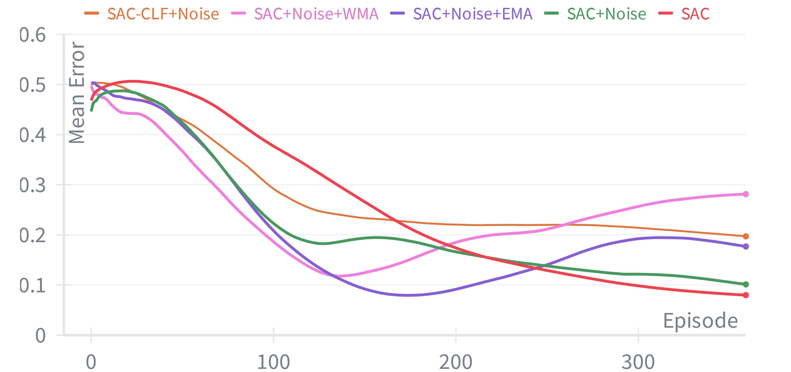

# Human-Like Autonomous Driving via Deep Reinforcement Learning with External Action Filtering

<p align="center">
  
</p>

<p align="center">
  <a href="https://doi.org/XXXX"></a>
  
  
  
  
</p>

---

> **Suppressing Control Oscillations in Reinforcement Learning via External Action Filtering for Autonomous Driving**  
> Mehmet Yaşar Osman Özturan · Ahmet Emir Dirik  
> *Computer Engineering Department, Bursa Uludağ University, Türkiye*  
> **ELECO 2025**

---

## Overview

Deep Reinforcement Learning (DRL) agents operating in continuous action spaces often produce **high-frequency, non-human-like control oscillations** — a critical barrier to passenger comfort and social acceptance of autonomous vehicles.

This repository presents a **modular DRL architecture** that cleanly separates the primary driving task from the secondary objective of action smoothing. Rather than baking smoothness into a complex multi-objective reward function, we apply a dedicated **external action filtering module** downstream of the policy network.

**Key result:** A Weighted Moving Average (WMA) filter reduces action volatility by **over 92%** compared to an unfiltered SAC baseline, while maintaining strong lane-keeping and obstacle avoidance performance.

---

## Method

### System Architecture

<p align="center">
  
</p>

The system is built on three decoupled stages:

1. **Perception** — Raw sensor data (camera + LiDAR) is compressed into compact 16-dimensional feature vectors using two dedicated autoencoders.
2. **Decision & Control** — A Soft Actor-Critic (SAC) agent learns the driving policy over a temporally-enriched state vector.
3. **Action Filtering** — Raw policy outputs are smoothed by an external filter before actuation, enforcing human-like continuity without modifying the reward signal.

### State Representation

The state vector $s_t$ concatenates:
- Encoded camera features at $t$ and $t{-1}$
- Encoded LiDAR features at $t$ and $t{-1}$
- Vehicle kinematics (speed, acceleration) at $t$ and $t{-1}$
- Actions taken at $t{-1}$ and $t{-2}$

This temporal stacking provides the Markovian dynamic context needed for robust control.

### Soft Actor-Critic (SAC)

SAC optimizes a **maximum entropy objective**, balancing expected cumulative reward with policy entropy:

$$J(\pi) = \sum_{t=0}^{T} \mathbb{E}_{(s_t, a_t) \sim \rho_\pi} \left[ r(s_t, a_t) + \alpha \mathcal{H}(\pi(\cdot \mid s_t)) \right]$$

The actor and two critic networks each use **two hidden layers of 1024 units**. Actions are sampled via the reparameterization trick:

$$a_t = \mu_\phi(s_t) + \sigma_\phi(s_t) \cdot \epsilon_t, \quad \epsilon_t \sim \mathcal{N}(0,1)$$

<p align="center">
  
</p>

### Action Smoothing Filters

Two low-pass filtering strategies are evaluated as the external smoothing module:

**Exponential Moving Average (EMA)** — blends the current raw action with the previously smoothed action:

$$\tilde{a}_t = w \cdot a_t + (1 - w) \cdot \tilde{a}_{t-1}, \quad w = 0.5$$

**Weighted Moving Average (WMA)** — computes a linearly weighted average over the last $n$ actions, prioritizing the most recent:

$$\tilde{a}_t = \frac{n \cdot a_t + (n-1) \cdot \tilde{a}_{t-1} + \cdots + 1 \cdot \tilde{a}_{t-n+1}}{n + (n-1) + \cdots + 1}, \quad n = 5$$

### Reward Function

The composite reward encourages lane centering, speed regulation, and mild action smoothness:

$$R(t) = R_{cc}(t) \cdot R_{spd}(t) - R_{act}(t) + 1$$

| Component | Description |
|-----------|-------------|
| $R_{cc}(t)$ | Lane centering — penalizes cross-track error |
| $R_{spd}(t)$ | Speed regulation — Gaussian centered on target speed |
| $R_{act}(t)$ | Smoothness regularizer — minor penalty on large action changes |

---

## Experiments

### Setup

- **Simulator:** [Donkey Car](https://docs.donkeycar.com/) 3D simulator, *mountain-track*
- **Task:** Simultaneous lane keeping + static obstacle avoidance
- **Action space:** Continuous steering and throttle/brake in $[-1, 1]$
- **Episode termination:** Lane deviation, collision, or 300-step limit

### Models Evaluated

| Model | Description |
|-------|-------------|
| `SAC` | Unmodified baseline |
| `SAC+Noise` | SAC with Ornstein–Uhlenbeck exploration noise |
| `SAC+Noise+EMA` | OU noise + EMA action filter |
| `SAC+Noise+WMA` | OU noise + WMA action filter |
| `SAC-CLF+Noise` | OU noise + smoothness objective in the actor loss (coupled baseline) |

---

## Results

### Training Performance

<p align="center">
  
  
</p>

<p align="center">
  
  
</p>

**Training summary:**

| Model | Mean Action Change (%) | Mean Error (%) |
|-------|------------------------|----------------|
| SAC | 36.61 | 21.01 |
| SAC+Noise | 37.37 | 18.29 |
| SAC+Noise+EMA | 21.62 | 18.36 |
| SAC+Noise+WMA | **12.75** | 23.23 |
| SAC-CLF+Noise | 20.66 | 25.03 |

### Testing Performance

<p align="center">
  
</p>

**Test summary (500-step evaluation, no exploration noise):**

| Model | Mean Action Change (%) | Mean Error (%) |
|-------|------------------------|----------------|
| SAC | 72.02 | 8.11 |
| SAC+Noise | 73.90 | 4.26 |
| SAC+Noise+EMA | 38.36 | **2.09** |
| SAC+Noise+WMA | **5.64** | 6.40 |
| SAC-CLF+Noise | 26.33 | 8.30 |

> The **WMA-filtered agent** achieves a **92.4% reduction in action volatility** versus the unfiltered SAC+Noise baseline — producing smooth, human-like control with a modest, acceptable increase in task error.

---

## Repository Structure

```
├── autoencoders/         # Convolutional and FC autoencoders for perception
├── sac/                  # SAC agent implementation (actor, critics, value nets)
├── filters/              # EMA and WMA action smoothing modules
├── envs/                 # Donkey Car environment wrappers
├── train.py              # Training entry point
├── evaluate.py           # Evaluation and test drive script
├── configs/              # Hyperparameter configs
├── assets/               # Images used in this README
└── requirements.txt
```

---

## Getting Started

### Prerequisites

```bash
pip install -r requirements.txt
```

You will also need the [Donkey Car simulator](https://docs.donkeycar.com/) binary for your platform.

### Training

```bash
python train.py --model SAC+Noise+WMA --config configs/wma.yaml
```

### Evaluation

```bash
python evaluate.py --checkpoint checkpoints/sac_wma_best.pt --steps 500
```

---

## Citation

If you find this work useful, please cite:

```bibtex
@inproceedings{ozturan2025suppressing,
  title     = {Suppressing Control Oscillations in Reinforcement Learning via External Action Filtering for Autonomous Driving},
  author    = {Özturan, Mehmet Yaşar Osman and Dirik, Ahmet Emir},
  booktitle = {ELECO 2025 -- International Conference on Electrical and Electronics Engineering},
  year      = {2025}
}
```

---

## License

This project is licensed under the MIT License. See [LICENSE](LICENSE) for details.

---

<p align="center">
  <i>Bursa Uludağ University · Computer Engineering Department</i>
</p>
